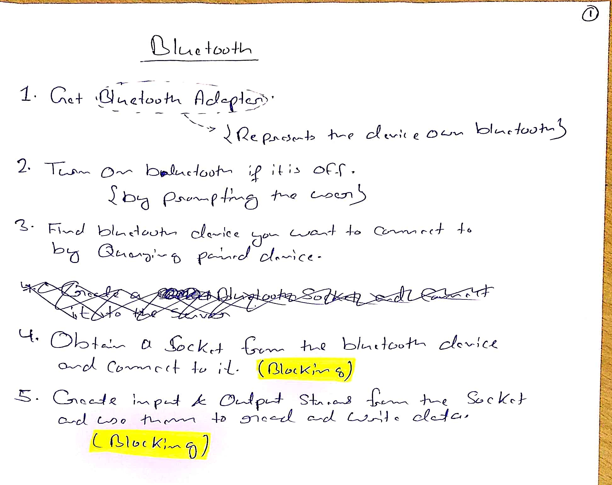

# Bluetooth
1. [Set up Bluetooth](./Set%20up%20Bluetooth/index.md)
2. [Find Bluetooth devices](./Find%20Bluetooth%20devices/index.md)
3. [Connect Bluetooth devices](./Connect%20Bluetooth%20devices/index.md)
4. [Transfer Bluetooth data](./Transfer%20Bluetooth%20data/index.md)
5. [Bluetooth Permissions](./Bluetooth%20Permissions/index.md)

# Bluetooth Overview
Android platform includes support for the Bluetooth network stack, which allows a device to wirelessly exchange data with other Bluetooth devices.

The app framework provides access to the Bluetooth functionality through **Bluetooth APIs**.
    - These APIs let apps connect to other Bluetooth devices, enabling point-to-point and multipoint wireless features.
    - Using the Bluetooth APIs, an app can perform the following:
        - Scan for other Bluetooth devices.
        - Query the local Bluetooth adapter for paired Bluetooth devices.
        - Establish RFCOMM channels.
        - Connect to other devices through service discovery.
        - Transfer data to and from other devices.
        - Manage multiple connections.

Four major tasks necessary to communicate using Bluetooth:
1. Setting up Bluetooth.
2. Finding devices that are either paired or available in the local area.
3. Connecting devices.
4. Transferring data between devices.

## Basics
For Bluetooth-enabled devices to transmit data between each other, they must first form a channel of communication using a pairing process.

1. One device, a discoverable device, makes itself available for incoming connection requests.
2. Another device finds the discoverable device using a service discovery process.
3. After the discoverable device accepts the pairing request, the two devices complete a bonding process in which they exchange security keys.
4. After the pairing and bonding processes are complete, the two devices exchange information.
5. When the session is complete, the device that initiated the pairing request releases the channel that had linked it to the discoverable device.
6. The two devices remain bonded, however, so they can reconnect automatically during a future session as long as they're in range of each other and neither device has removed the bond.

# HandWritten Notes

<p\>
