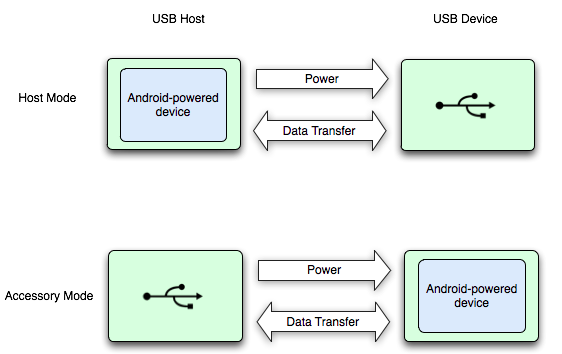

Android supports a variety of **USB peripherals** and **Android USB accessories** through two modes:
1. USB accessory
    - The external USB hardware act as the USB hosts
    - Android USB accessories must be designed to work with Android-powered devices and must adhere to the Android accessory communication protocol.
2. USB host
    - Android-powered device acts as the host

