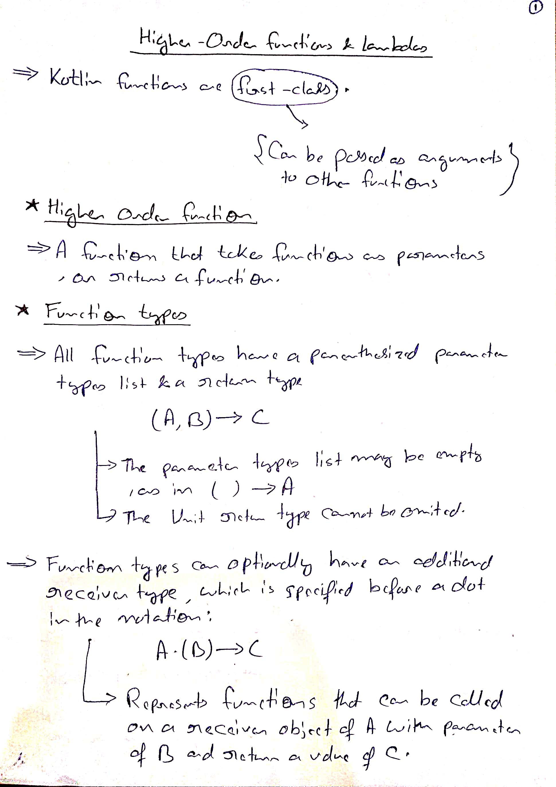
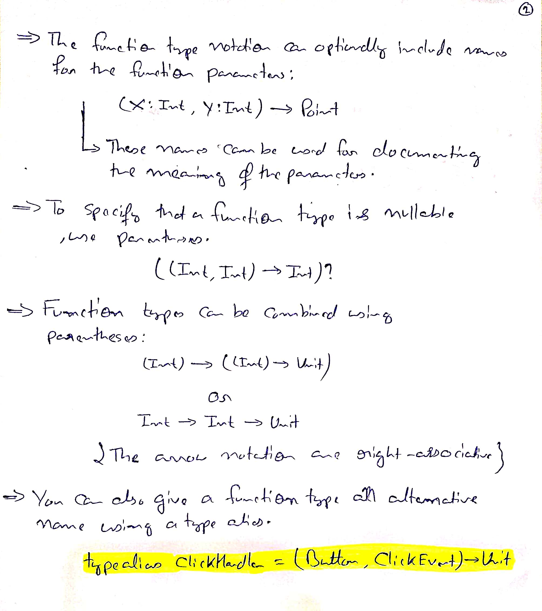
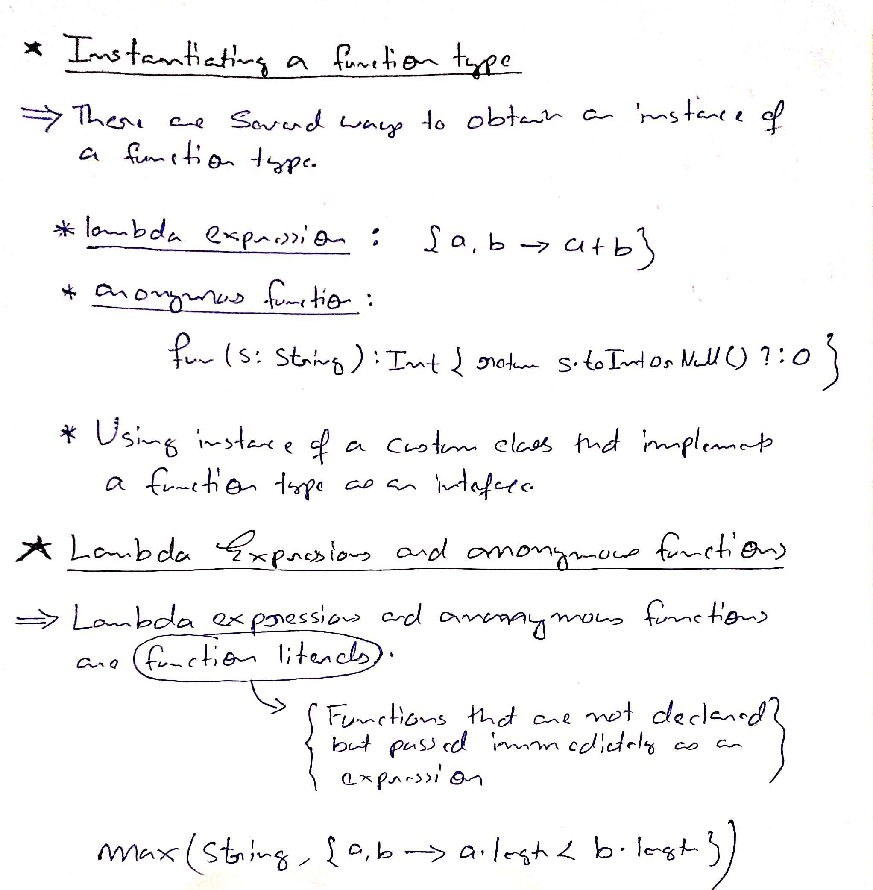
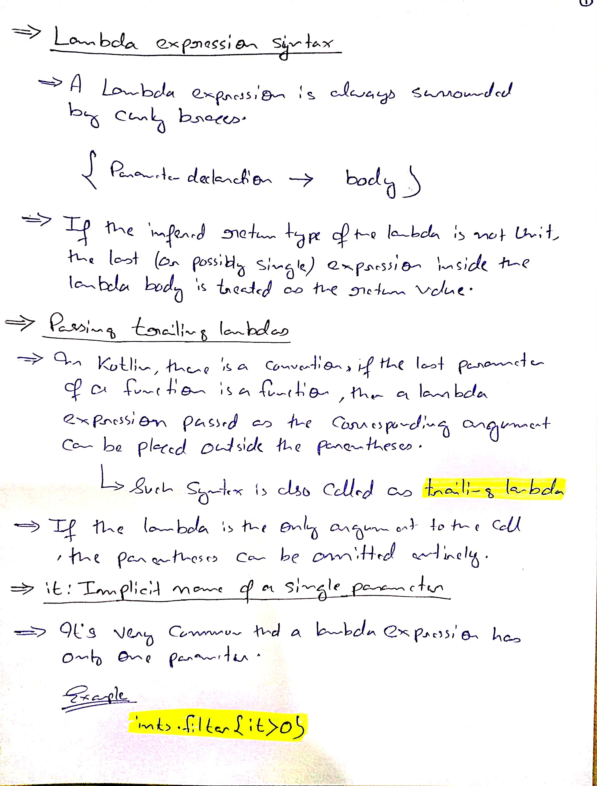
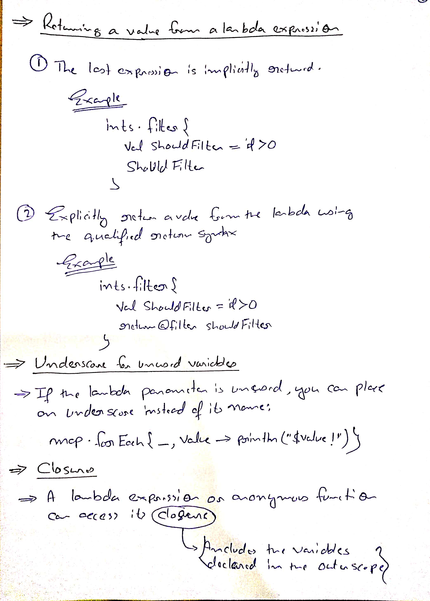

# High-order functions and lambdas

## Appendices
* [Trailing Lambdas Example](./Appendices/Trailing%20Lambdas%20Example.md)

## References
* [High-order functions and lambdas](https://kotlinlang.org/docs/lambdas.html)

## HandWritten Notes

<p\>
