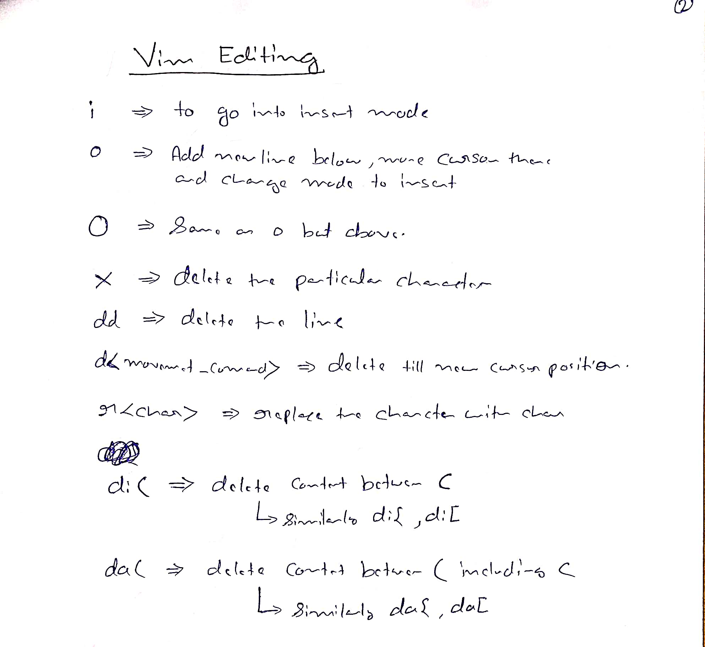

# Vim Editing

## Appendices
* [Additional](./Appendices/Additional.md)
* [Auto Completion](./Appendices/Auto%20Completion.md)
* [Commentary Plugin](./Appendices/Commentary%20Plugin.md)
* [Nouns in vim](./Appendices/Nouns%20in%20vim.md)
* [Surround Plugin](./Appendices/Surround%20Plugin.md)

## HandWritten Notes

<p\>
