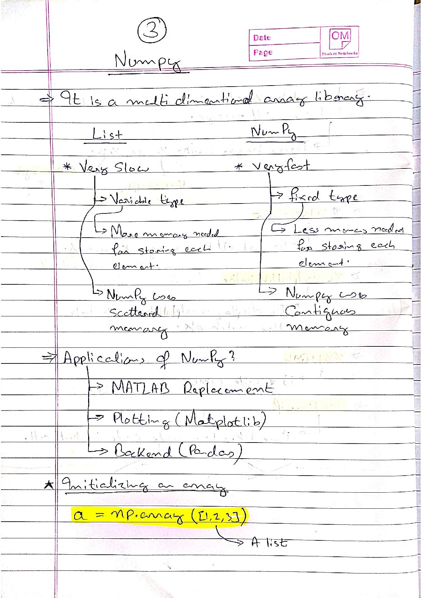
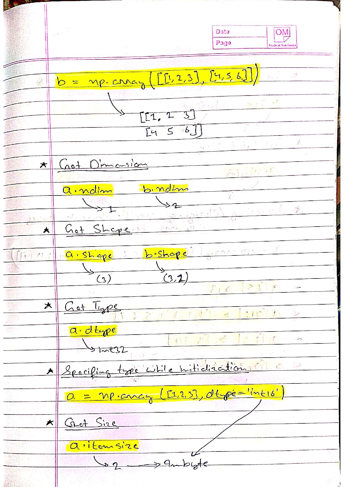
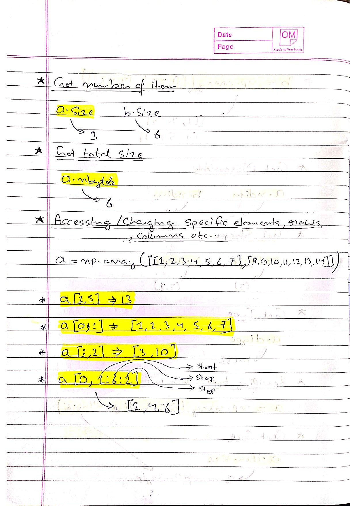
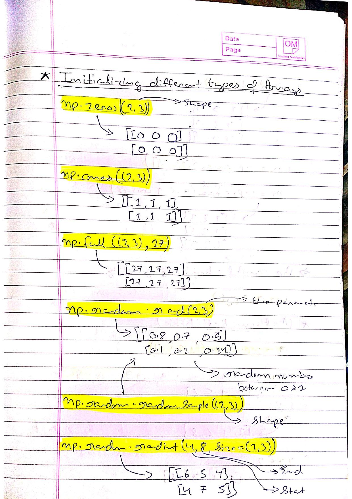
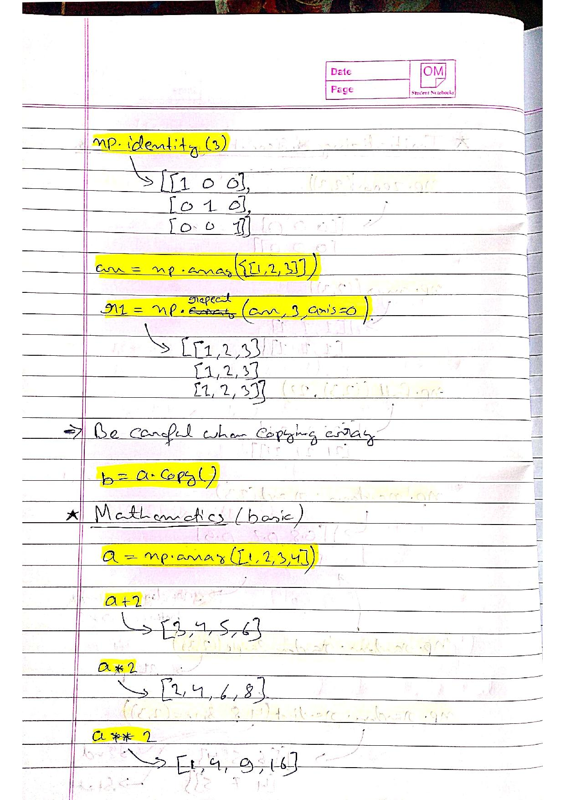
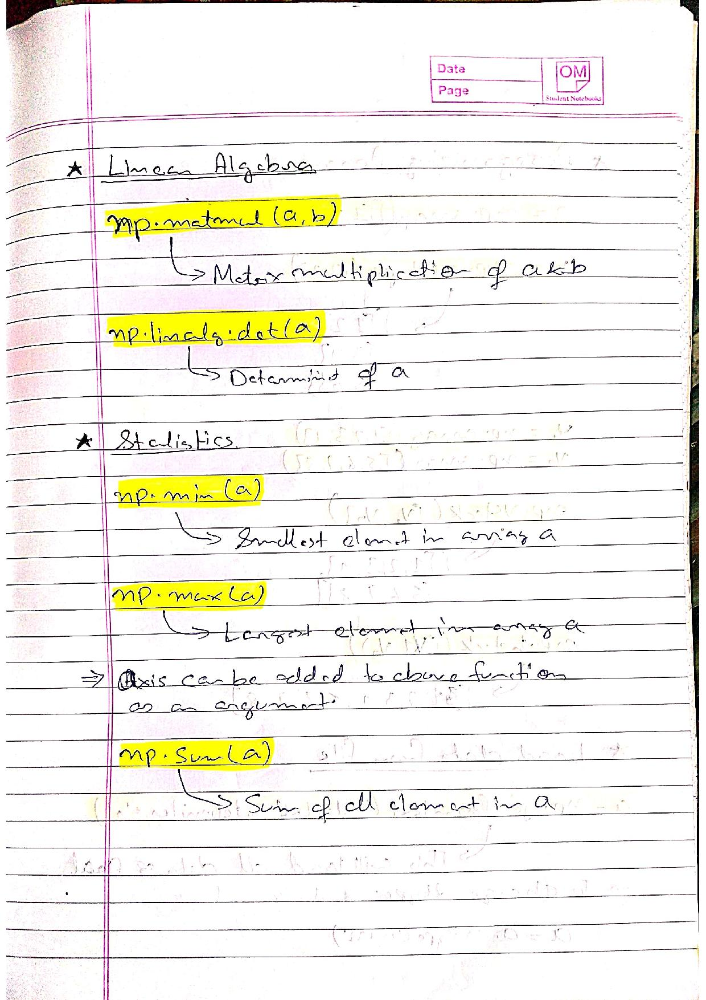
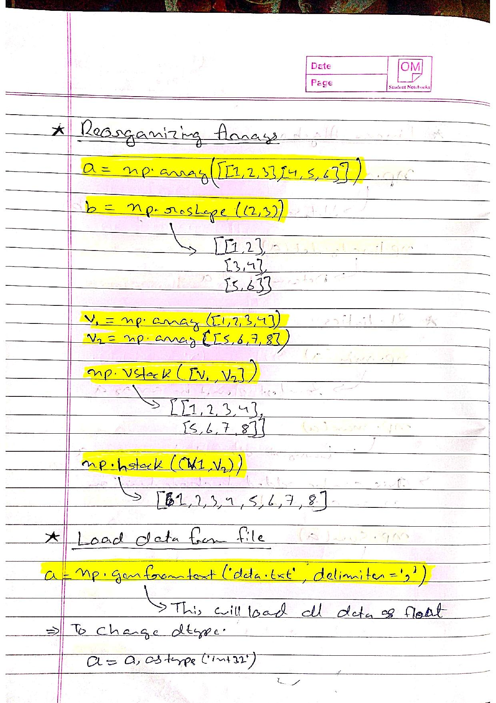
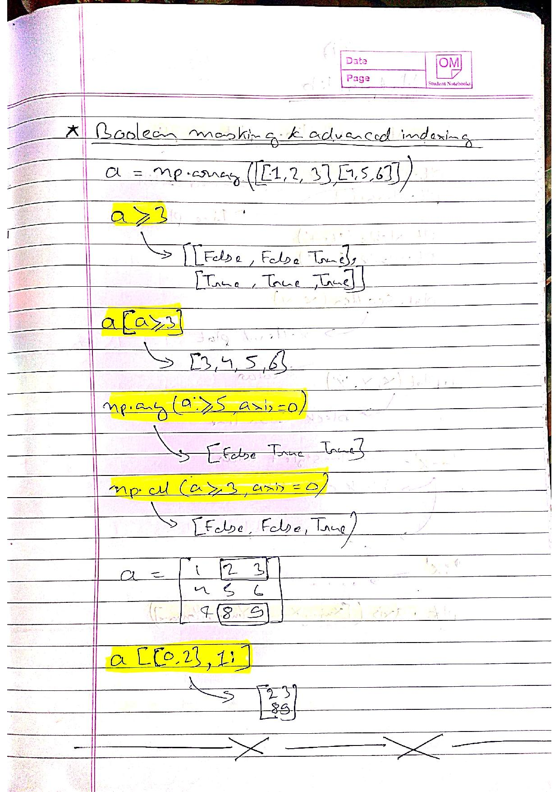

# Numpy
1. [Change dtype of numpy array](./Change%20dtype%20of%20numpy%20array/index.md)
2. [dot](./dot/index.md)
3. [expand_dims](./expand_dims/index.md)
4. [linalg.norm](./linalg.norm/index.md)
5. [load text and save text](./load%20text%20and%20save%20text/index.md)
6. [squeeze](./squeeze/index.md)
7. [tensordot](./tensordot/index.md)

## References
* [numpy.argsort](https://numpy.org/doc/stable/reference/generated/numpy.argsort.html)
* [numpy.argmax](https://numpy.org/doc/stable/reference/generated/numpy.argmax.html)
* [numpy.sum](https://numpy.org/doc/stable/reference/generated/numpy.sum.html)
* [numpy.matmul](https://numpy.org/doc/stable/reference/generated/numpy.matmul.html)
* [numpy.transpose](https://numpy.org/doc/stable/reference/generated/numpy.transpose.html)
* [numpy.array_split](https://numpy.org/doc/stable/reference/generated/numpy.array_split.html)
* [numpy.vstack](https://numpy.org/doc/stable/reference/generated/numpy.vstack.html#:~:text=vstack-,numpy.,to%20(1%2CN).)
* [numpy.random.randn](https://numpy.org/doc/stable/reference/random/generated/numpy.random.randn.html)
* [numpy.zeros_like](https://numpy.org/doc/stable/reference/generated/numpy.zeros_like.html#:~:text=zeros_like,-numpy.&text=Return%20an%20array%20of%20zeros,type%20as%20a%20given%20array.&text=The%20shape%20and%20data%2Dtype,attributes%20of%20the%20returned%20array.)
* [numpy.random.choice](https://numpy.org/doc/stable/reference/random/generated/numpy.random.choice.html)
* [np.random.normal](https://numpy.org/doc/stable/reference/random/generated/numpy.random.normal.html)

# HandWritten Notes

<p\>
