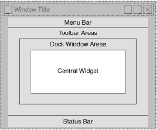

# PyQt5
1. [Qt Designer](./Qt%20Designer/index.md)
2. [Signals & Slots](./Signals%20&%20Slots/index.md)
3. [Layout Management](./Layout%20Management/index.md)
4. [QDialog](./QDialog/index.md)
5. [QMessageBox](./QMessageBox/index.md)
6. [Multiple Document Interface](./Multiple%20Document%20Interface/index.md)
7. [Drag and Drop](./Drag%20and%20Drop/index.md)
8. [Database Handling](./Database%20Handling/index.md)

## References
* [Source](https://www.tutorialspoint.com/pyqt5/index.htm)

# Notes
PyQt5 is the latest version of a GUI **widgets** toolkit.
  - **Widgets:** In a graphical user interface widgets is an element of interaction, such as a button or a scroll bar.

PyQt API is a set of modules containing a large number of classes and functions.
  - **QtCore:** Core non-GUI classes used by other modules
  - **QtGui:** Graphical user interface components
  - QtMultimedia, QtNetwork, QtOpenGL, QtSvg etc...

PyQt API contains more than 400 classes.
  - **QObject:** The QObject class is at the top of class hierarchy. It is the base class of all Qt objects.
  - **QPaintDevice:** Base class for all objects that can be painted.
  - **QApplication:** QApplication class manages the main settings and control flow of a GUI application.
    - It contains main event loop inside which events generated by window elements and other sources are processed and dispatched.
    - It also handles system-wide and application-wide settings.
  - **QWidget:** QWidget class, derived from QObject and QPaintDevice classes is the base class for all user interface objects.
    - **QDialog** and **QFrame** classes are also derived from QWidget class.

