# Python Core
1. [*args and **kwargs](./*args%20and%20**kwargs/index.md)
2. [String](./String/index.md)
3. [dict()](./dict()/index.md)
4. [lambda](./lambda/index.md)
5. [--name--](./--name--/index.md)
6. [Passing dictionary as function argument](./Passing%20dictionary%20as%20function%20argument/index.md)
7. [sys.argv](./sys.argv/index.md)
8. [Argparse](./Argparse/index.md)
9. [range](./range/index.md)

## Appendices
* [Python Arithmetic Operators](./Appendices/Python%20Arithmetic%20Operators/index.md)
* [with statement](./Appendices/with%20statement/index.md)

## References
* [Learn Python - Full Course for Beginners [Tutorial]](https://www.youtube.com/watch?v=rfscVS0vtbw&list=PLgnQpQtFTOGRKTPxhXZ68kKAQtsy76s0S&index=3)
* [vars()](https://www.programiz.com/python-programming/methods/built-in/vars)
* [itertools](https://docs.python.org/3/library/itertools.html)

# HandWritten Notes

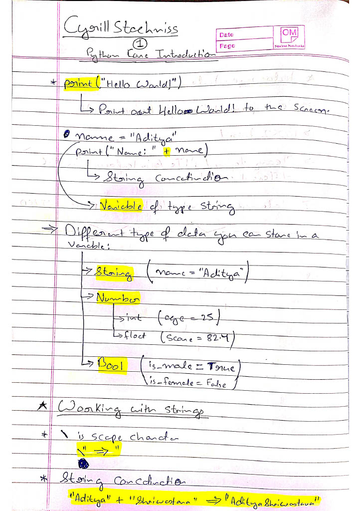
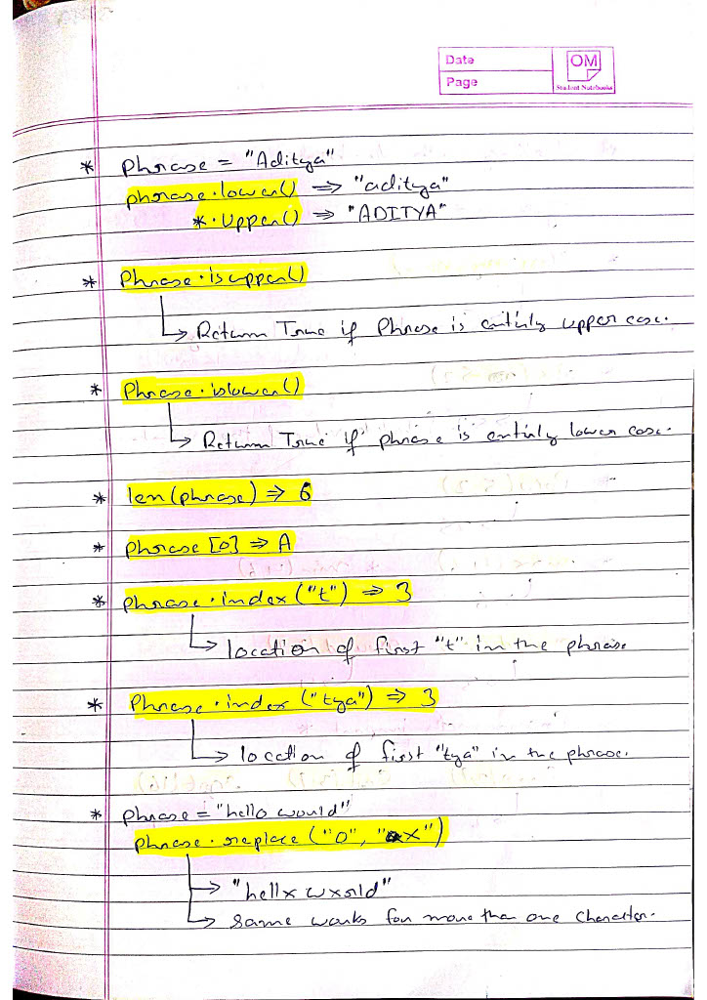
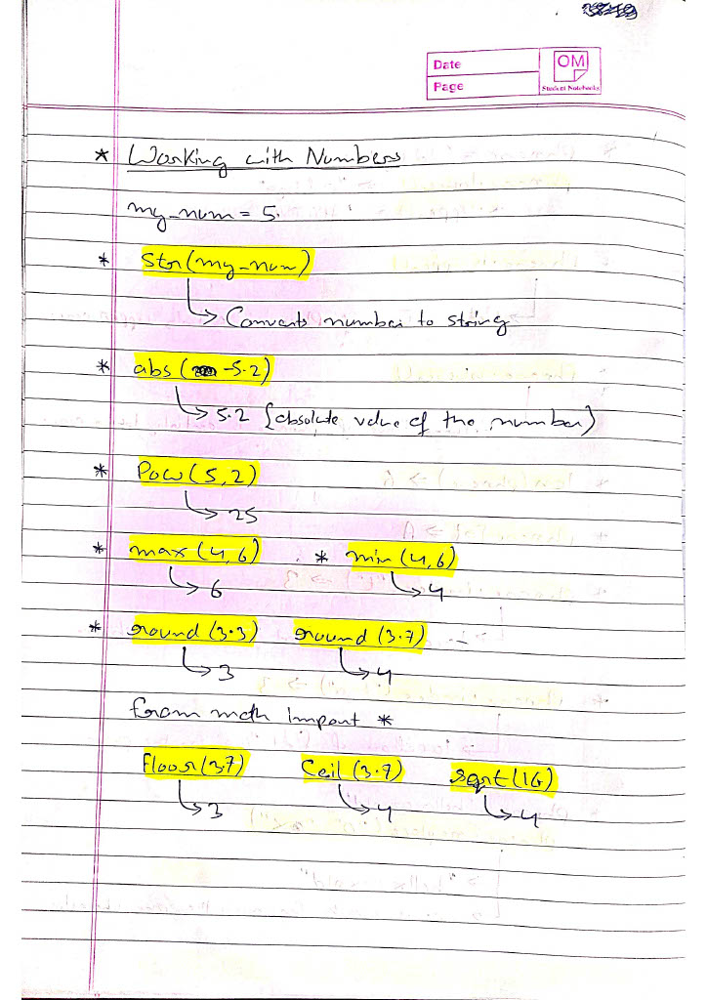
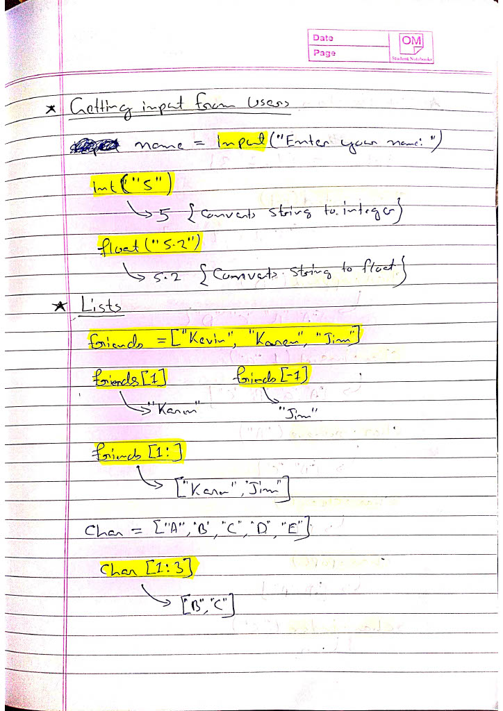
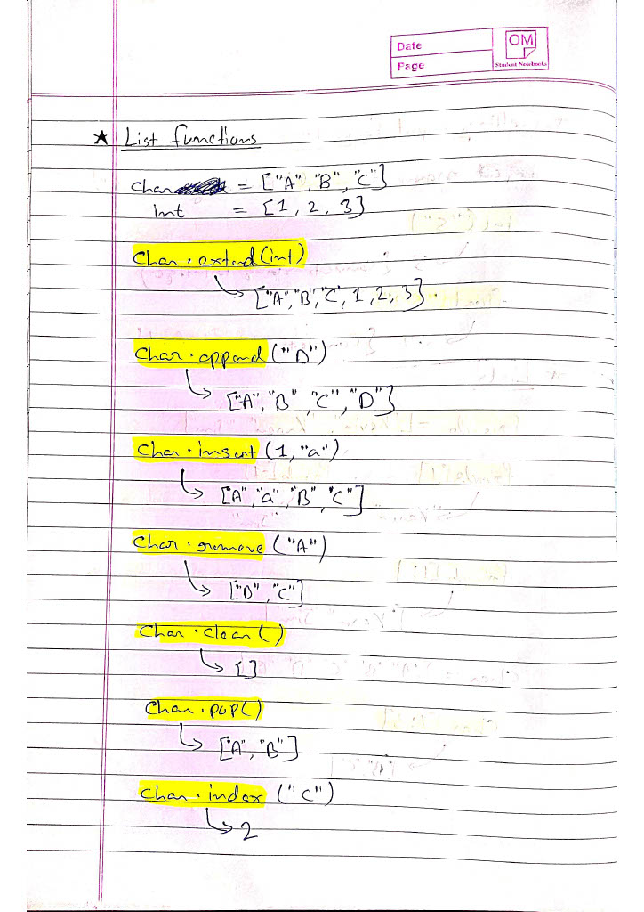
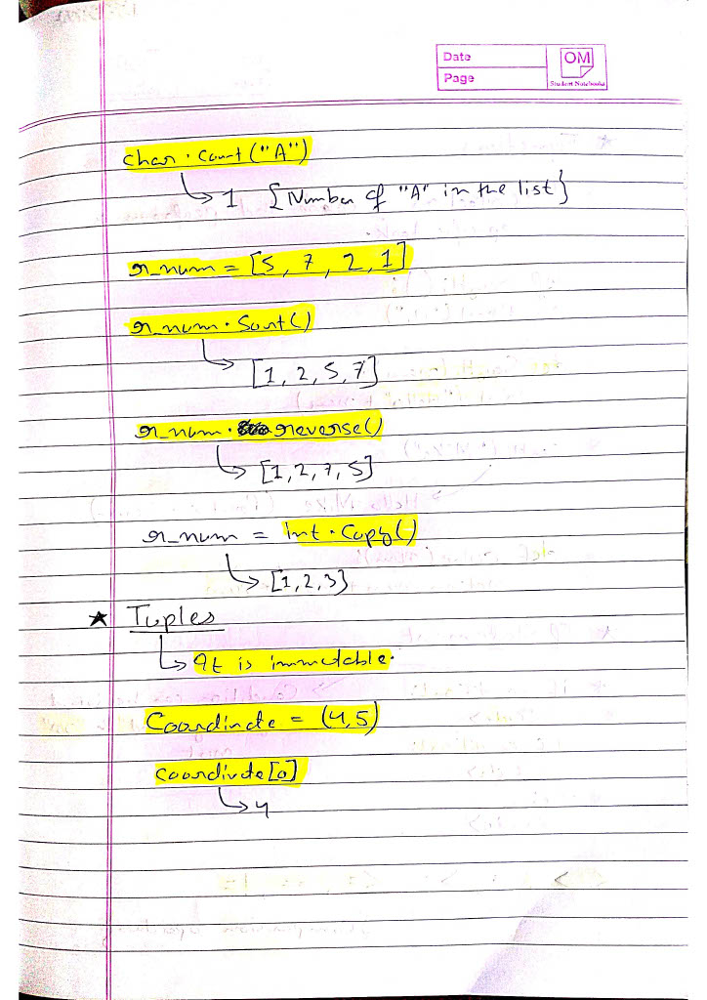
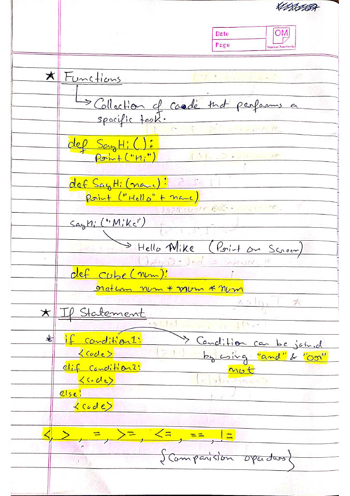
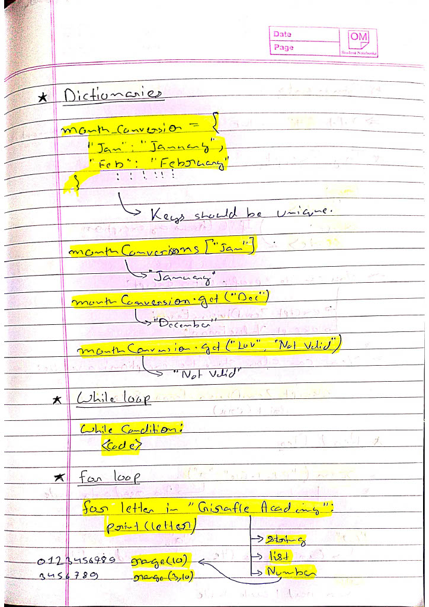
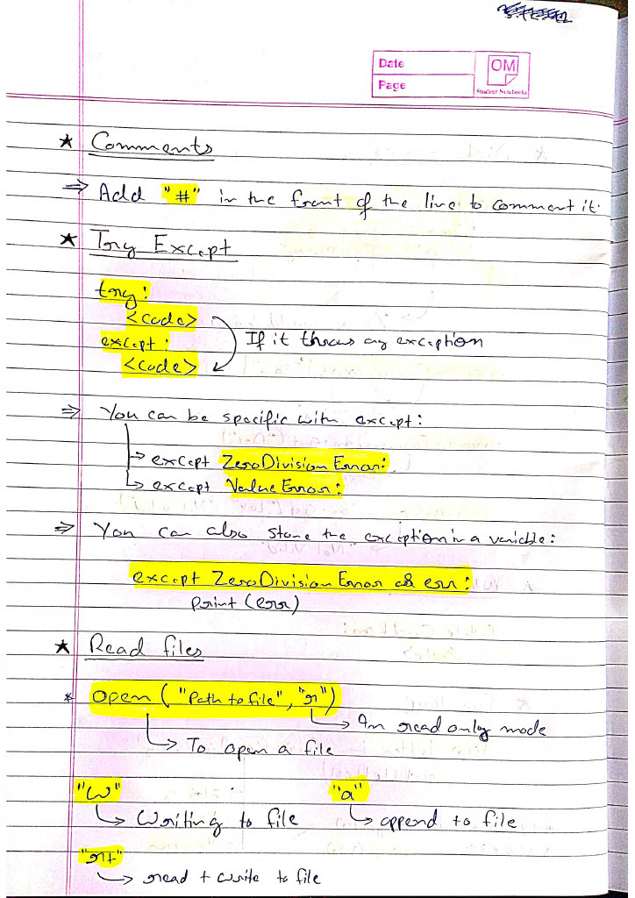
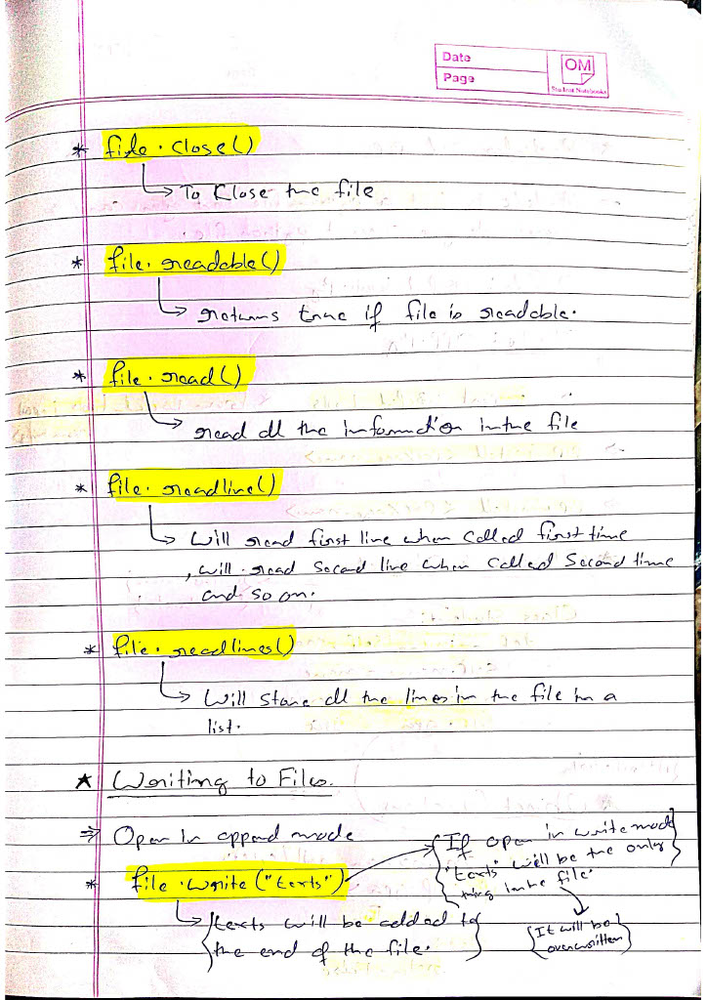
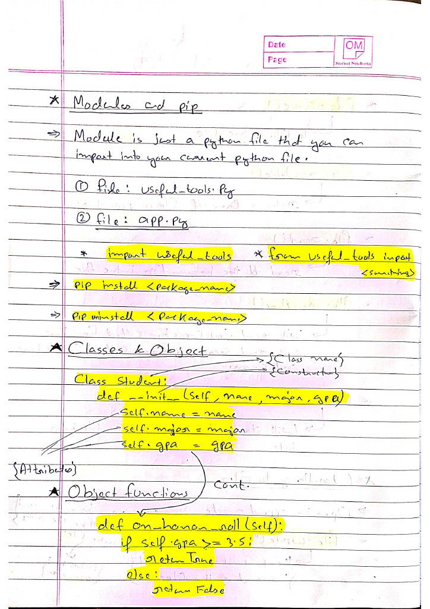
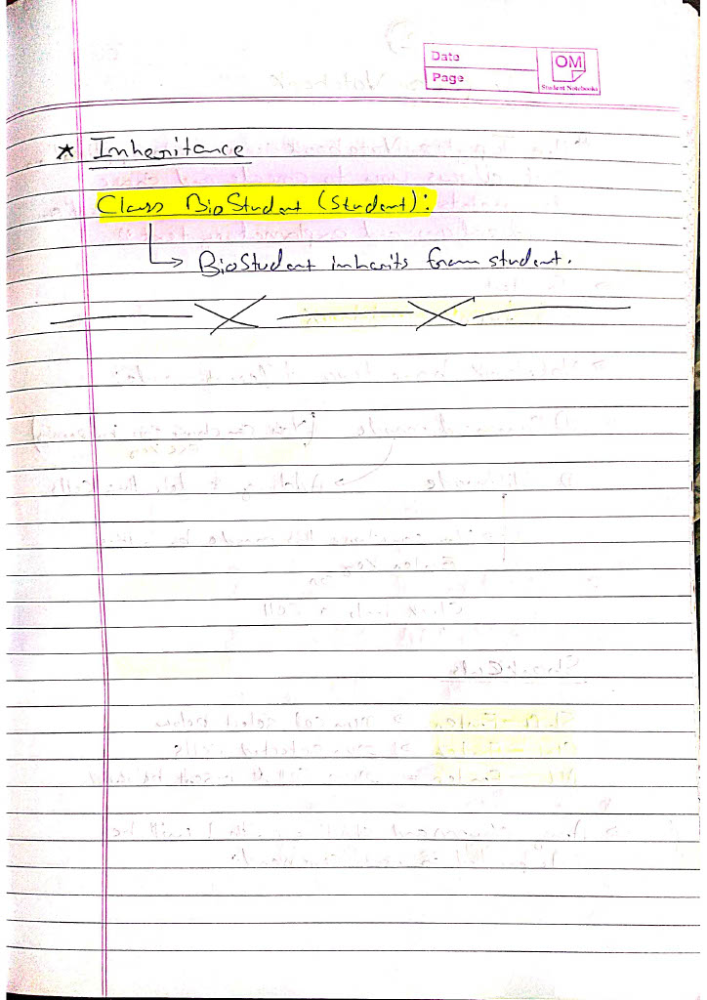
<p\>
